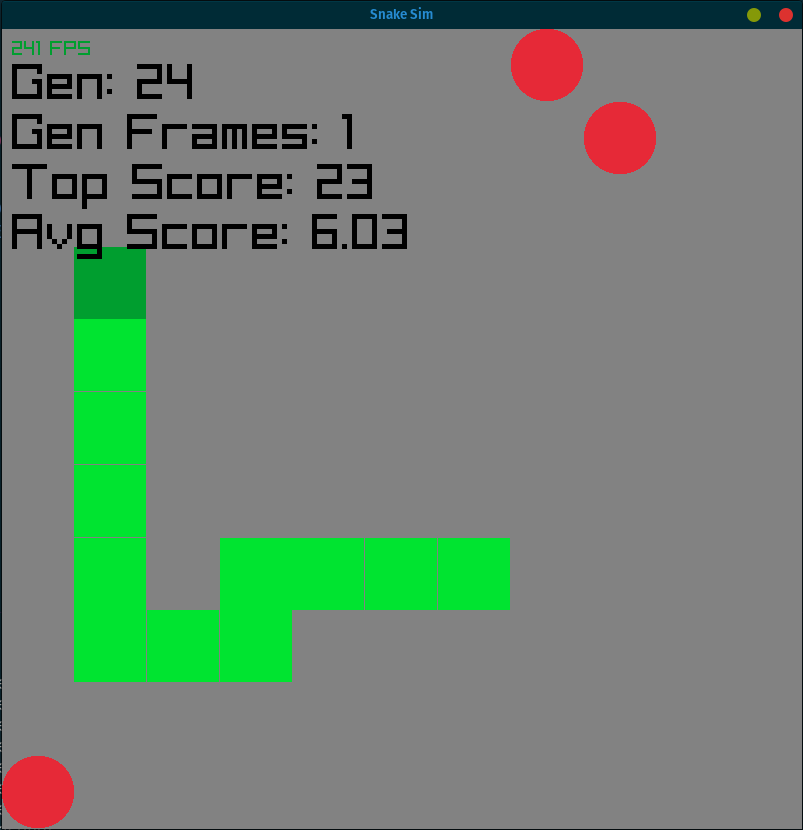

# Evolutionary Snake

This project uses [brainjs](https://brain.js.org/#/) and an evolutionary algorithm to develop neural networks to play the classic game of snake.

1000 snakes are created every generation and simulate moving about the board and collecting food. After all snakes in a generation have died, the weights and biases of the top snake's neural networks are used to repopulate the next generation - with some random mutation. Over time, the snakes learn to collect food and navigate without running into themselves.
